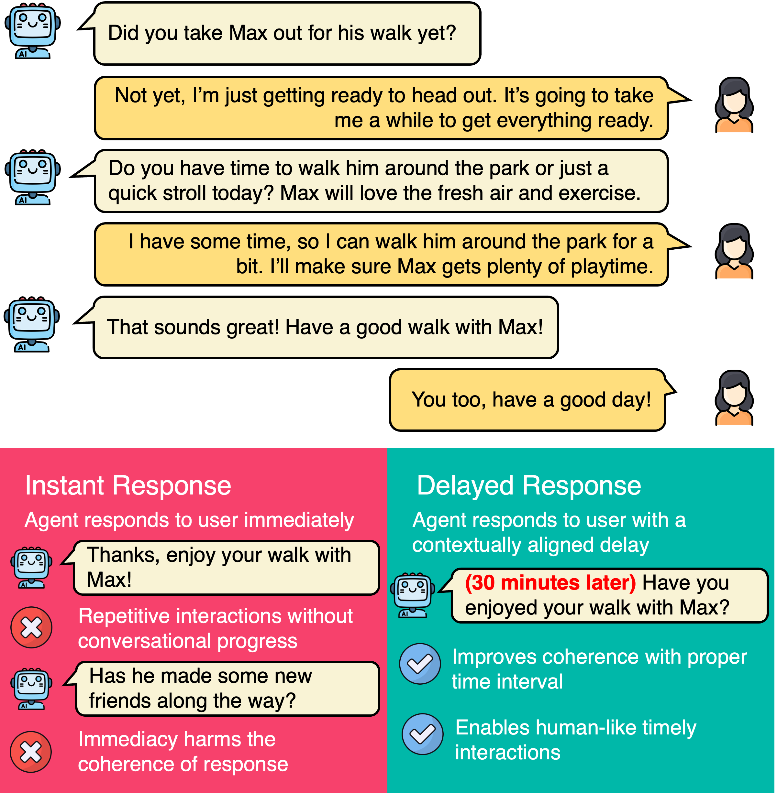
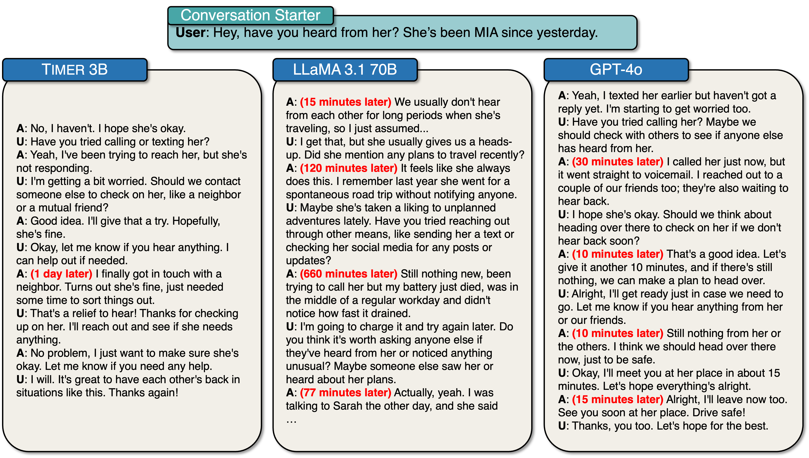

# ⏰ TIMER: A Dialog Agent for Timely Responses

<p align="center">
  
</p>


<p align="center">
  <a href="#"></a>
  <a href="https://huggingface.co/datasets/anonymous17711771/timelychat"></a>
  <a href="https://huggingface.co/anonymous17711771/timer-3b"></a>
</p>

This is the official repository for the paper **"From *what to respond* to *when to respond*: Timely Response Generation for Open-domain Dialog Agents"**.

## 📋 Table of Contents

- [Overview](#-overview)
- [Dataset](#-dataset)
- [Model Checkpoint](#-model-checkpoint)
- [Evaluation Metrics](#-evaluation-metrics)
- [Results](#-results)
- [Quick Start](#-quick-start)
- [Citation](#-citation)

## 🎯 Overview

**TIMER** is a dialog agent that addresses the critical challenge of *when to respond* in open-domain conversations, going beyond traditional approaches that focus solely on *what to respond*.

Traditional dialog systems generate responses based on context, but they often ignore the temporal appropriateness of responses. For example, responding "Have you enjoyed your meal?" immediately after someone says "I'm having lunch with my friends." is inappropriate, whereas the same response becomes appropriate after 1 hour has elapsed.

Our approach enables TIMER to:
1. **Predict when to respond** by estimating response timing (delay) between turns
2. **Generate what to respond** that are contextually and temporally appropriate
3. **Maintain natural conversation flow** while respecting temporal dynamics

## 📦 Dataset

**TimelyChat** is a large-scale dataset for timely response generation, featuring:
- 324 test examples with human-annotated temporal information
- 55,000+ multi-turn conversations for training
- 7.5 average turns per conversation
- Realistic time intervals ranging from minutes to hours

TimelyChat dataset is available on [🤗 HuggingFace Datasets Hub](https://huggingface.co/datasets/anonymous17711771/timelychat).

```python
from datasets import load_dataset

dataset = load_dataset("anonymous17711771/timelychat")
```

## 🤖 Model Checkpoint

TIMER-3B is a 3B parameter model for timely response generation that is:
- Built upon T5 architecture (seq2seq)
- Fine-tuned on the augmented training set of TimelyChat
- Capable of predicting response delay and generating time-conditioned responses

TIMER-3B is available on [🤗 HuggingFace Model Hub](https://huggingface.co/anonymous17711771/timer-3b).

```python
from transformers import AutoModel, AutoTokenizer

model = AutoModel.from_pretrained("anonymous17711771/timer-3b")
tokenizer = AutoTokenizer.from_pretrained("anonymous17711771/timer-3b")
```

## 📈 Evaluation Metrics

### Turn-level Metrics

- **Response Timing Prediction**:
  - Precision, Recall, F1, FPR (for binary intent classification)
  - RMSLE (for time regression)
  
- **Timely Response Generation**:
  - BLEU-2
  - ROUGE-L
  - BERTScore
  - **Naturalness**: How appropriate responses are to conversational context
  - **Time Specificity**: How specific responses are to temporal context

### Dialog-level Metrics

- **Coherence**: How well agents maintain natural flow
- **Delay Appropriateness**: Whether agents pose delays with appropriate timing and amount of time
- **Time Specificity**: How well agents generate responses that reflect temporal context

## 📊 Results

### Turn-level Evaluation

#### Response Timing Prediction

| Model | P ↑ | R ↑ | F1 ↑ | FPR ↓ | RMSLE ↓ |
|-------|-----|-----|------|-------|---------|
| Llama-3.1 8B | 17.2 | 69.1 | 27.6 | 60.6 | 2.853 |
| Llama-3.1 70B | 15.3 | 73.5 | 25.4 | 74.0 | 2.479 |
| GPT-3.5 | 14.3 | 78.4 | 24.1 | 86.1 | 2.763 |
| GPT-4o | 26.6 | 25.9 | 26.3 | 13.1 | 1.956 |
| **TIMER-3B** | **78.3** | **79.9** | **79.1** | **4.1** | **1.189** |

#### Time-conditioned Response Generation

| Model | BLEU-2 ↑ | ROUGE-L ↑ | BERTScore ↑ | Naturalness ↑ | Time Specificity ↑ |
|-------|----------|-----------|-------------|---------------|--------------------|
| Llama-3.1 8B | 5.38 | 12.38 | 86.21 | 2.24 | 2.78 |
| Llama-3.1 70B | 6.84 | 12.71 | 85.90 | 2.86 | 2.35 |
| GPT-3.5 | 9.97 | 17.13 | 87.54 | 4.26 | 2.86 |
| GPT-4o | 9.17 | 16.76 | 87.35 | **4.75** | 3.09 |
| **TIMER-3B** | **16.08** | **22.26** | **88.74** | 3.84 | **3.36** |

### Dialog-level Evaluation

| Model | Coherence ↑ | Delay Appropriateness ↑ | Time Specificity ↑ |
|-------|-------------|-------------------------|--------------------|
| Llama 3.1 8B | 2.97 | 2.38 | 2.30 |
| Llama 3.1 70B | 3.29 | 2.50 | 2.35 |
| GPT-3.5 | 3.17 | 1.86 | 1.13 |
| GPT-4o | **4.05** | 2.65 | 1.57 |
| **TIMER-3B** | 3.30 | **2.91** | **2.76** |

### Human Evaluation

Head-to-head comparison of TIMER-3B vs. GPT-4o (Win: TIMER-3B wins)

#### Turn-level Evaluation

| Metric | Win | Tie | Loss |
|--------|-----|-----|------|
| Naturalness | 19% | 24% | **57%** |
| Time Specificity | **54%** | 24% | 22% |

#### Dialog-level Evaluation

| Metric | Win | Tie | Loss |
|--------|-----|-----|------|
| Coherence | 21% | 18% | **61%** |
| Delay Appropriateness | **40%** | 23% | 37% |
| Time Specificity | **40%** | 23% | 37% |

### Example Conversations

<p align="center">
  
</p>

## 🚀 Quick Start

### Environment Setup

```bash
python -m venv .venv
source .venv/bin/activate
pip install -r requirements.txt
```

### Turn-level Evaluation

#### Response Timing Prediction

```bash
python evaluate_turn-level.py --model-type hf \
    --model-name anonymous17711771/timer-3b \
    --task time \
    --icl-method zeroshot \
    --save-results \
    --do-incremental
```

#### Time-conditioned Response Generation

```bash
python evaluate_turn-level.py --model-type hf \
    --model-name anonymous17711771/timer-3b \
    --task response \
    --icl-method zeroshot \
    --save-results
```

### Dialog-level Evaluation

```bash
python evaluate_dialog-level.py --model-type hf \
    --model-name anonymous17711771/timer-3b \
    --simulator gpt-4o \
    --num-turns 10
```

### LLM-as-a-Judge

```bash
python laaj.py --task turn-level --model-name anonymous17711771/timer-3b
```

## 📄 Citation

```bibtex
TBA
```
